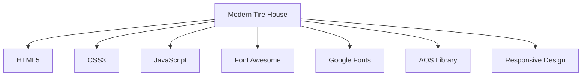

<h1 align="center">Modern Tire House</h1>
<p align="center">
  Static Website Repository
  <br />
  <br />
  <a href="#-deployment">Deployment</a>
  ·
  <a href="#-technologies">Technologies</a>
  ·
  <a href="#-development">Development</a>
</p>

<!-- BADGES -->
<div align="center">

[](https://moderntirehouse.com)
[](https://github.com/aarshps/modern-tire-house/commits/main)
[](https://github.com/aarshps/modern-tire-house)

</div>

## 📁 Project Overview

This repository contains the source code for the Modern Tire House website, a static HTML/CSS/JavaScript project deployed to https://moderntirehouse.com.

### 📁 Repository Structure

```
modern-tire-house/
├── home.html          # Main HTML file
├── favicon.ico        # Website favicon
├── README.md          # This file
├── .github/
│   └── workflows/     # GitHub Actions workflows
│       ├── deploy.yml
│       ├── clear-cache.yml
│       └── deploy-and-clear.yml
├── images/            # Background and content images
│   ├── hero.jpeg
│   ├── services.jpg
│   └── ... (various section images)
├── logos/             # Logo files
│   └── logo.png
├── products/          # Product category pages (if any)
└── services/          # Service detail pages (if any)
```

## 🔧 Technologies

This project uses modern web technologies:



* **Frontend**: Pure HTML, CSS, JavaScript (No frameworks)
* **Styling**: Custom CSS with modern design principles
* **Fonts**: Google Fonts (Inter, Space Grotesk, Playfair Display)
* **Icons**: Font Awesome 6.4.0
* **Animations**: AOS (Animate On Scroll) Library
* **Images**: Optimized JPEG format
* **Hosting**: cPanel Shared Hosting via FTP Deployment

## 🎨 Visual Assets

<details>
<summary>Click to view image gallery</summary>

| Section | Preview |
|--------|---------|
| Hero |  |
| Services |  |
| Products |  |
| Brands |  |
| Stats |  |
| About |  |
| Contact |  |
| Location |  |

</details>

## 🚀 Deployment

We use **GitHub Actions** for automated deployment to our cPanel hosting environment.

### Workflows

1. **[Full Process: Deploy and Clear Cache](.github/workflows/deploy-and-clear.yml)** - Master workflow
   ```mermaid
   graph LR
     A[Manual Trigger] --> B[Deploy Website]
     B --> C[Clear Sucuri Cache]
   ```

2. **[Module] Deploy Website via FTP** ([deploy.yml](.github/workflows/deploy.yml))
   * Uses [SamKirkland/FTP-Deploy-Action](https://github.com/SamKirkland/FTP-Deploy-Action)
   * Deploys files to `public_html/` directory
   * Requires FTP credentials as GitHub Secrets

3. **[Module] Clear Sucuri Cache** ([clear-cache.yml](.github/workflows/clear-cache.yml))
   * Sends cache clear request to Sucuri WAF API
   * Uses `curl` to POST to Sucuri API endpoint
   * Requires API Key and Secret as GitHub Secrets

### Manual Deployment

To manually trigger deployment:

1. Go to [Actions tab](../../actions)
2. Select **"Full Process: Deploy and Clear Cache"**
3. Click **"Run workflow"**

### Secrets Required

| Secret Name | Purpose |
|-------------|---------|
| `FTP_SERVER` | FTP server address |
| `FTP_USERNAME` | FTP username |
| `FTP_PASSWORD` | FTP password |
| `SUCURI_API_KEY` | Sucuri API key |
| `SUCURI_API_SECRET` | Sucuri API secret |

## 🛠️ Development

### Prerequisites

* A modern web browser
* A code editor (VS Code recommended)
* Basic knowledge of HTML, CSS, and JavaScript

### Getting Started

1. Clone the repo:
   ```sh
   git clone https://github.com/aarshps/modern-tire-house.git
   ```

2. Open `home.html` in your browser or editor

3. Make your changes

4. Test locally by opening in browser

### Code Standards

* **CSS Variables**: Used for consistent theming
* **Responsive Design**: Mobile-first approach with media queries
* **Accessibility**: Semantic HTML and ARIA attributes
* **Performance**: Optimized images and efficient code

## 🌐 Browser Support

| Browser | Support |
|---------|---------|
| Chrome  | ✅ Latest |
| Firefox | ✅ Latest |
| Safari  | ✅ Latest |
| Edge    | ✅ Latest |
| IE      | ❌ Not supported (CSS Grid, ES6+ JavaScript) |

## 📞 Contact

Aarsh - [@aarshps](https://github.com/aarshps)

Project Link: [https://github.com/aarshps/modern-tire-house](https://github.com/aarshps/modern-tire-house)

## 🙏 Acknowledgments

* [Font Awesome](https://fontawesome.com) - Icon library
* [Google Fonts](https://fonts.google.com) - Typography
* [AOS](https://michalsnik.github.io/aos/) - Animate on scroll library
* [Img Shields](https://shields.io) - Badges
* [Mermaid](https://mermaid-js.github.io/) - Diagrams

## 📈 Stats

<div align="center">


</div>

---

<p align="center">
  Made with ❤️ 
</p>

<!-- MARKDOWN LINKS & IMAGES -->
[product-screenshot]: images/hero.jpeg